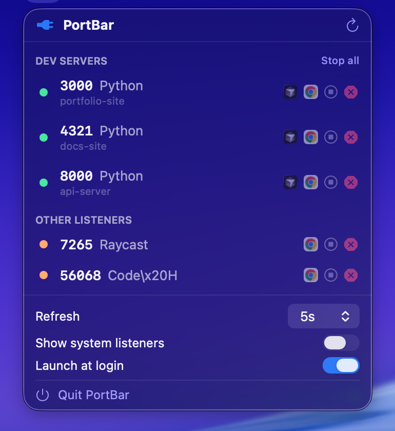

<p align="center">
  
</p>

<h1 align="center">PortBar</h1>

<p align="center">See what's running on your ports — and kill it — straight from the menu bar.</p>

<p align="center">
  <a href="https://github.com/AmirAjaj/PortBar/actions/workflows/ci.yml"></a>
  <a href="LICENSE"></a>
  
</p>

<p align="center">
  
</p>

## Why I made this

I kept ending up with a pile of dev servers running and no idea which was which.
Something on 3000, something on 8000, half of them forgotten in terminal tabs I'd
already closed. Then the usual `EADDRINUSE: address already in use` and a hunt for
the right PID to kill.

PortBar is the little tool I wanted: click the menu bar, see every dev server
with the project it belongs to, and kill it in one click. That's it.

## What it does

- Lists every listening TCP port with its process and the project folder it's
  running from, so `3000 — node (my-app)` instead of just a number.
- A green/orange dot tells you whether it's actually answering or just sitting
  there hung.
- Kill a server gracefully, or force it, without going near the terminal.
- Open it in your browser, or jump straight to the project in your editor,
  Finder, or a terminal.
- Hides macOS's own background daemons so you only see things you care about.
- "Stop all" when you just want a clean slate.

It's a native SwiftUI menu bar app — no Electron, no background service. Under the
hood it just shells out to `lsof`.

## Install

**Homebrew:**

```bash
brew tap amirajaj/portbar https://github.com/AmirAjaj/PortBar
brew install --cask portbar
```

It isn't notarized yet, so the first launch macOS will complain it can't be
checked for malware. Either open **System Settings → Privacy & Security** and hit
*Open Anyway*, or run this once:

```bash
xattr -dr com.apple.quarantine "/Applications/PortBar.app"
```

**Manual:** grab `PortBar.zip` from the
[latest release](https://github.com/AmirAjaj/PortBar/releases/latest), unzip it,
and drop `PortBar.app` into Applications.

**Updating:** PortBar checks GitHub for newer releases and shows a "download"
link in the menu when one is available. Homebrew users can just run
`brew upgrade --cask portbar`. (Silent in-place updates would need notarization —
see [#6](https://github.com/AmirAjaj/PortBar/issues/6).)

## Build it yourself

You need macOS 14+ and a Swift 6 toolchain (Xcode or the Command Line Tools).

```bash
git clone https://github.com/AmirAjaj/PortBar.git
cd PortBar
make run        # run it straight away
make install    # build PortBar.app and copy it to ~/Applications
```

The icon is generated from code, not a design file — `swift Scripts/make-icons.swift`.

## How it works

Every few seconds it runs `lsof -nP -iTCP -sTCP:LISTEN` to find listening sockets.
For each one it looks up the process's executable path (to spot and hide system
daemons under `/System`, `/usr/bin`, etc.) and its working directory (to label it
with the project). A port counts as a dev server if the command looks like one
(`node`, `vite`, `python`, `cargo`, …) or it's running from somewhere under your
home folder. The health dot is just a quick HTTP `HEAD` with a short timeout.

The code lives in `Sources/PortBar/`, roughly one file per concern (scanning,
the model, the menu UI, killing, launch-at-login).

## Ideas / roadmap

- a search box for when there are a lot of ports
- custom labels you can pin to a port ("this 8000 is the API")
- a notification when a server comes up or a port frees
- notarized builds so Gatekeeper stops complaining

PRs welcome — it's a small codebase and there's plenty of low-hanging fruit.

## License

MIT — see [LICENSE](LICENSE).
